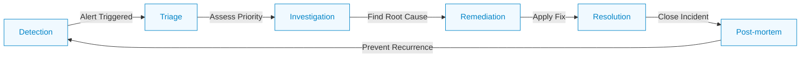
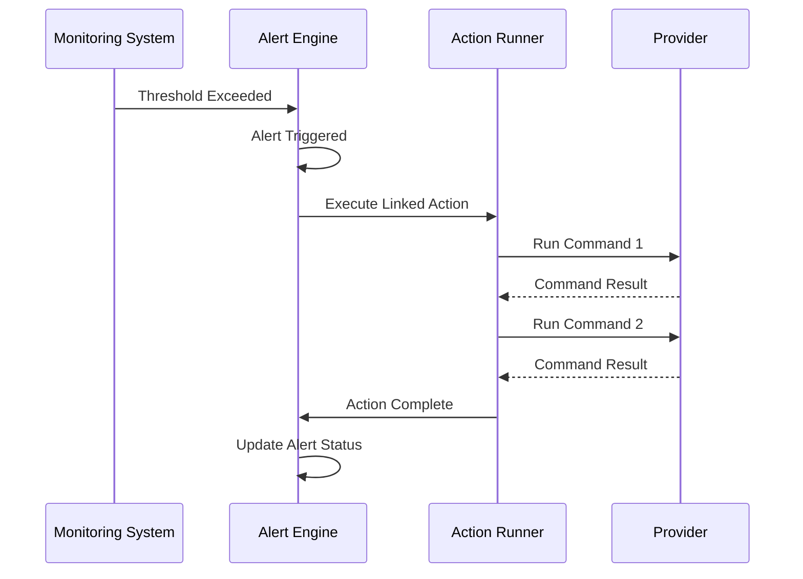
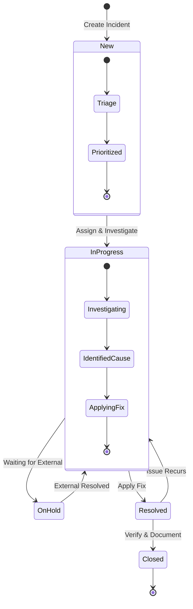
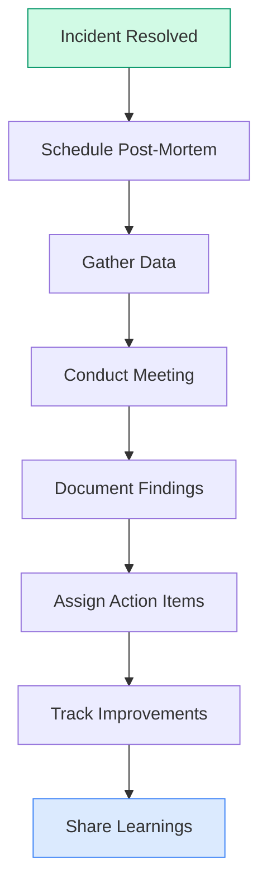
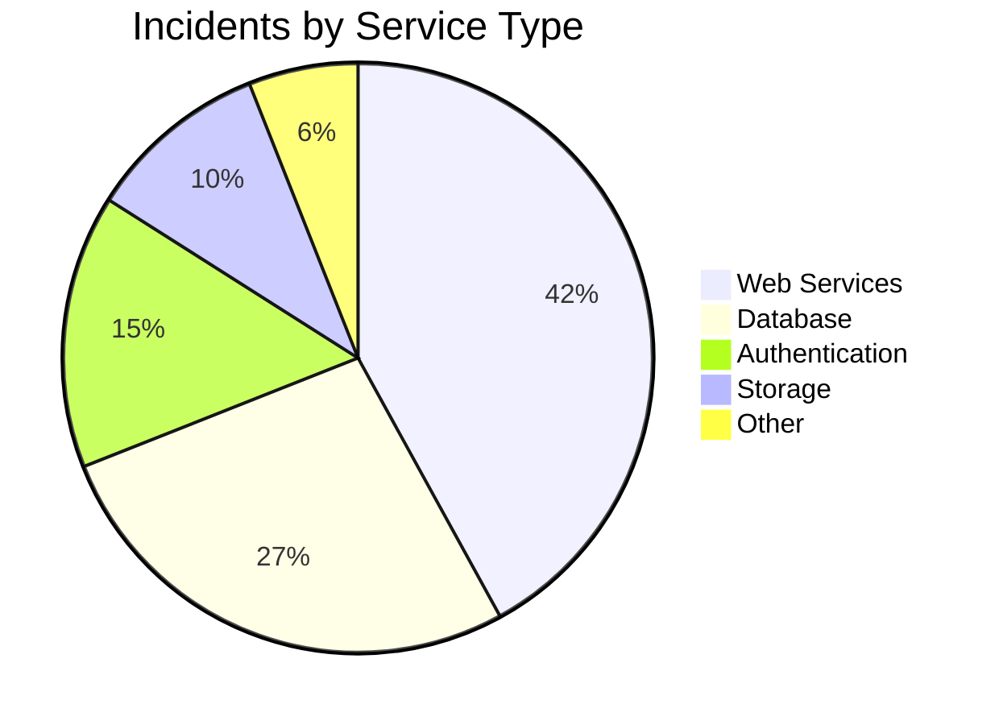

import Tabs from '@theme/Tabs';
import TabItem from '@theme/TabItem';

# Incident Response

<div className="incident-response-header">
  <div className="incident-response-content">
    <h2 className="incident-response-subtitle">Rapid Resolution Framework</h2>
    <p>OpsiMate provides powerful incident response capabilities to help you quickly address and resolve issues with your services through automation, structured workflows, and comprehensive tracking.</p>
  </div>
</div>

## Understanding Incident Response in OpsiMate

<div className="incident-overview">
  <div className="incident-overview-content">
    <p>An effective incident response process helps minimize downtime and service disruption. OpsiMate provides a comprehensive framework for managing incidents from detection to resolution.</p>
  </div>
</div>

<div className="feature-grid">
  <div className="feature-card">
    <div className="feature-icon">🔔</div>
    <h3>Automatic Detection</h3>
    <p>Identify issues through alerts and monitoring before they impact users</p>
  </div>
  <div className="feature-card">
    <div className="feature-icon">📋</div>
    <h3>Structured Workflows</h3>
    <p>Follow defined processes for consistent incident handling</p>
  </div>
  <div className="feature-card">
    <div className="feature-icon">⚡</div>
    <h3>Automated Remediation</h3>
    <p>Execute pre-defined actions to resolve common issues</p>
  </div>
  <div className="feature-card">
    <div className="feature-icon">📊</div>
    <h3>Incident Analytics</h3>
    <p>Track history and metrics to improve future response</p>
  </div>
</div>

## Incident Lifecycle

<div className="lifecycle-diagram">



</div>

<div className="lifecycle-steps">
  <div className="lifecycle-step">
    <div className="step-number">1</div>
    <div className="step-content">
      <h3>Detection</h3>
      <p>An alert is triggered based on monitoring rules when metrics exceed thresholds or anomalies are detected.</p>
      <div className="step-actions">
        <span className="step-tag">Automatic</span>
        <span className="step-tag">Alert-based</span>
      </div>
    </div>
  </div>
  
  <div className="lifecycle-step">
    <div className="step-number">2</div>
    <div className="step-content">
      <h3>Triage</h3>
      <p>The incident is assessed and prioritized based on impact, urgency, and available resources.</p>
      <div className="step-actions">
        <span className="step-tag">Manual/Automatic</span>
        <span className="step-tag">Priority-based</span>
      </div>
    </div>
  </div>
  
  <div className="lifecycle-step">
    <div className="step-number">3</div>
    <div className="step-content">
      <h3>Investigation</h3>
      <p>The root cause is identified through log analysis, metrics examination, and diagnostic actions.</p>
      <div className="step-actions">
        <span className="step-tag">Guided</span>
        <span className="step-tag">Data-driven</span>
      </div>
    </div>
  </div>
  
  <div className="lifecycle-step">
    <div className="step-number">4</div>
    <div className="step-content">
      <h3>Remediation</h3>
      <p>Actions are taken to resolve the issue, either through automated responses or manual intervention.</p>
      <div className="step-actions">
        <span className="step-tag">Automated/Manual</span>
        <span className="step-tag">Action-based</span>
      </div>
    </div>
  </div>
  
  <div className="lifecycle-step">
    <div className="step-number">5</div>
    <div className="step-content">
      <h3>Resolution</h3>
      <p>The incident is marked as resolved after confirming the service is functioning properly again.</p>
      <div className="step-actions">
        <span className="step-tag">Verification</span>
        <span className="step-tag">Documentation</span>
      </div>
    </div>
  </div>
  
  <div className="lifecycle-step">
    <div className="step-number">6</div>
    <div className="step-content">
      <h3>Post-mortem</h3>
      <p>Analysis is conducted to understand what happened, why it happened, and how to prevent recurrence.</p>
      <div className="step-actions">
        <span className="step-tag">Learning</span>
        <span className="step-tag">Prevention</span>
      </div>
    </div>
  </div>
</div>

:::tip Response Time Optimization
Combining automated detection with pre-configured remediation actions can reduce Mean Time To Resolution (MTTR) by up to 70% for common incidents.
:::

## Setting Up Automated Actions

<div className="actions-intro">
  <p>OpsiMate's automated actions provide powerful remediation capabilities that can be triggered manually or automatically when incidents occur. This significantly reduces resolution time and ensures consistent handling of common issues.</p>
</div>

<Tabs>
  <TabItem value="create" label="Creating Actions" default>

<div className="action-creation-container">
  <div className="action-creation-steps">
    <h3>Creating a Custom Action</h3>
    
    <div className="numbered-step">
      <div className="step-circle">1</div>
      <div className="step-content">
        <p>Navigate to the <strong>Actions</strong> page from the main sidebar</p>
      </div>
    </div>
    
    <div className="numbered-step">
      <div className="step-circle">2</div>
      <div className="step-content">
        <p>Click the <strong>Create Action</strong> button in the top-right corner</p>
      </div>
    </div>
    
    <div className="numbered-step">
      <div className="step-circle">3</div>
      <div className="step-content">
        <p>Configure the action details:</p>
        <div className="config-form">

| Field | Description | Example |
|-------|-------------|--------|
| **Name** | Descriptive name for your action | `Restart Nginx Service` |
| **Description** | What the action does | `Restarts the Nginx web server when it becomes unresponsive` |
| **Category** | Group similar actions | `Web Services` |
| **Estimated Duration** | Expected execution time | `30 seconds` |
| **Tags** | Keywords for filtering | `nginx, webserver, restart` |

        </div>
      </div>
    </div>
    
    <div className="numbered-step">
      <div className="step-circle">4</div>
      <div className="step-content">
        <p>Add action steps:</p>
        <div className="code-example">

```json
{
  "steps": [
    {
      "name": "Check Nginx Status",
      "provider": "web-server-01",
      "command": "systemctl status nginx",
      "timeout": 10,
      "retries": 0,
      "condition": "always"
    },
    {
      "name": "Restart Nginx",
      "provider": "web-server-01",
      "command": "sudo systemctl restart nginx",
      "timeout": 20,
      "retries": 2,
      "condition": "previous_success"
    },
    {
      "name": "Verify Restart",
      "provider": "web-server-01",
      "command": "curl -I http://localhost",
      "timeout": 10,
      "retries": 3,
      "condition": "previous_success"
    }
  ]
}
```

        </div>
      </div>
    </div>
    
    <div className="numbered-step">
      <div className="step-circle">5</div>
      <div className="step-content">
        <p>Click <strong>Save</strong> to create the action</p>
      </div>
    </div>
  </div>
  
  <!-- Image placeholder: Create Action screenshot -->
</div>

:::caution Command Execution
Actions run commands with the permissions of the user specified in the provider configuration. Ensure this user has appropriate permissions for the commands in your action steps.
:::

  </TabItem>
  <TabItem value="templates" label="Using Templates">

<div className="templates-container">
  <h3>Action Templates</h3>
  <p>OpsiMate provides pre-built action templates for common scenarios to help you get started quickly.</p>
  
  <div className="template-grid">
    <div className="template-card">
      <div className="template-icon">🔄</div>
      <h4>Service Restart</h4>
      <p>Restart a failed service with proper status checks</p>
      <div className="template-tags">
        <span className="template-tag">systemd</span>
        <span className="template-tag">service</span>
      </div>
    </div>
    
    <div className="template-card">
      <div className="template-icon">💾</div>
      <h4>Disk Cleanup</h4>
      <p>Free up disk space by removing logs and temporary files</p>
      <div className="template-tags">
        <span className="template-tag">storage</span>
        <span className="template-tag">maintenance</span>
      </div>
    </div>
    
    <div className="template-card">
      <div className="template-icon">📑</div>
      <h4>Log Collection</h4>
      <p>Gather and compress logs for analysis</p>
      <div className="template-tags">
        <span className="template-tag">diagnostics</span>
        <span className="template-tag">troubleshooting</span>
      </div>
    </div>
    
    <div className="template-card">
      <div className="template-icon">🔍</div>
      <h4>Health Check</h4>
      <p>Run comprehensive diagnostics on a service</p>
      <div className="template-tags">
        <span className="template-tag">monitoring</span>
        <span className="template-tag">diagnostics</span>
      </div>
    </div>
    
    <div className="template-card">
      <div className="template-icon">💾</div>
      <h4>Backup & Restore</h4>
      <p>Create or restore backups of critical data</p>
      <div className="template-tags">
        <span className="template-tag">data</span>
        <span className="template-tag">recovery</span>
      </div>
    </div>
  </div>
  
  <div className="template-usage">
    <h4>Using a Template</h4>
    <ol>
      <li>Navigate to the <strong>Actions</strong> page</li>
      <li>Click <strong>Use Template</strong></li>
      <li>Browse and select a template from the gallery</li>
      <li>Customize the template for your environment</li>
      <li>Click <strong>Save</strong> to create the action</li>
    </ol>
  </div>
  
  <!-- Image placeholder: Action templates selection -->
</div>

:::tip Template Customization
Templates are starting points that you can customize to fit your specific environment. Always review and test templates before using them in production.
:::

  </TabItem>
  <TabItem value="example" label="Example Action">

<div className="example-action">
  <h3>Example: Memory Cleanup Action</h3>
  
  <p>This example action helps resolve memory pressure issues on a Linux server:</p>
  
  <div className="example-steps">
    <h4>Step 1: Check Memory Usage</h4>
    
```bash
free -m && ps aux --sort=-%mem | head -n 10
```
    
    <h4>Step 2: Clear Page Cache</h4>
    
```bash
sudo sh -c 'echo 1 > /proc/sys/vm/drop_caches'
```
    
    <h4>Step 3: Restart Memory-Intensive Services (Conditional)</h4>
    
```bash
# Only runs if memory is still above 90% after clearing cache
if [ $(free | grep Mem | awk '{print $3/$2 * 100.0}') -gt 90 ]; then
  sudo systemctl restart memory-intensive-service
fi
```
    
    <h4>Step 4: Verify Memory Status</h4>
    
```bash
free -m
```
  </div>
  
  <div className="action-metadata">
    <div className="metadata-item">
      <strong>Estimated Duration:</strong> 45 seconds
    </div>
    <div className="metadata-item">
      <strong>Success Rate:</strong> 94%
    </div>
    <div className="metadata-item">
      <strong>Usage Count:</strong> 127 times
    </div>
  </div>
</div>

  </TabItem>
</Tabs>

## Linking Actions to Alerts

<div className="linking-intro">
  <p>One of OpsiMate's most powerful features is the ability to automatically trigger remediation actions when alerts fire. This creates a closed-loop system that can resolve many incidents without human intervention.</p>
</div>

<div className="alert-action-diagram">



</div>

<div className="setup-steps">
  <h3>Setting Up Automated Responses</h3>
  
  <div className="numbered-step">
    <div className="step-circle">1</div>
    <div className="step-content">
      <p>Navigate to the <strong>Monitoring</strong> page</p>
    </div>
  </div>
  
  <div className="numbered-step">
    <div className="step-circle">2</div>
    <div className="step-content">
      <p>Select an existing alert or create a new one</p>
    </div>
  </div>
  
  <div className="numbered-step">
    <div className="step-circle">3</div>
    <div className="step-content">
      <p>In the alert configuration, find the <strong>Automated Response</strong> section</p>
    </div>
  </div>
  
  <div className="numbered-step">
    <div className="step-circle">4</div>
    <div className="step-content">
      <p>Click <strong>Add Action</strong> and select an action from your saved actions</p>
    </div>
  </div>
  
  <div className="numbered-step">
    <div className="step-circle">5</div>
    <div className="step-content">
      <p>Configure when the action should trigger:</p>
      
      <div className="trigger-options">
        <div className="trigger-option">
          <h4>Immediately</h4>
          <p>Run as soon as the alert fires</p>
          <div className="best-for">Best for: Critical services requiring instant recovery</div>
        </div>
        
        <div className="trigger-option">
          <h4>After Delay</h4>
          <p>Wait a specified time before running</p>
          <div className="best-for">Best for: Transient issues that may self-resolve</div>
        </div>
        
        <div className="trigger-option">
          <h4>After Approval</h4>
          <p>Require manual approval before running</p>
          <div className="best-for">Best for: High-risk actions or production environments</div>
        </div>
      </div>
    </div>
  </div>
  
  <div className="numbered-step">
    <div className="step-circle">6</div>
    <div className="step-content">
      <p>Click <strong>Save</strong> to link the action to the alert</p>
    </div>
  </div>
</div>

<!-- Image placeholder: Linking an action to an alert -->

:::info Multiple Actions
You can link multiple actions to a single alert with different trigger conditions. For example, you might run a non-intrusive diagnostic action immediately, followed by a more aggressive remediation action after approval.
:::

## Manual Incident Response

<div className="manual-response-intro">
  <p>While automation handles many incidents, some situations require human judgment and intervention. OpsiMate provides a structured workflow for manual incident response.</p>
</div>

<Tabs>
  <TabItem value="create" label="Creating an Incident" default>

<div className="incident-creation">
  <h3>Starting the Incident Response Process</h3>
  
  <div className="alert-to-incident">
    <div className="alert-box">
      <div className="alert-header">
        <span className="alert-icon">🔔</span>
        <span className="alert-name">High CPU Usage</span>
        <span className="alert-status critical">CRITICAL</span>
      </div>
      <div className="alert-details">
        <p>web-server-01 CPU usage > 95% for 5 minutes</p>
        <div className="alert-metrics">
          <span>Current: 97%</span>
          <span>Threshold: 90%</span>
        </div>
      </div>
      <div className="alert-actions">
        <button className="create-incident-btn">Create Incident</button>
      </div>
    </div>
    
    <div className="arrow">→</div>
    
    <div className="incident-form">
      <h4>New Incident</h4>
      <div className="form-fields">
        <div className="form-field">
          <label>Title</label>
          <input value="High CPU usage on web-server-01" />
        </div>
        <div className="form-field">
          <label>Priority</label>
          <select>
            <option>P1 - Critical</option>
            <option selected>P2 - High</option>
            <option>P3 - Medium</option>
            <option>P4 - Low</option>
          </select>
        </div>
        <div className="form-field">
          <label>Assignee</label>
          <select>
            <option>Unassigned</option>
            <option selected>Current User</option>
            <option>On-Call Engineer</option>
            <option>DevOps Team</option>
          </select>
        </div>
        <div className="form-field">
          <label>Description</label>
          <textarea>Web server showing sustained high CPU usage, potentially affecting site performance. Alert triggered at 14:32 UTC.</textarea>
        </div>
      </div>
    </div>
  </div>
</div>

  </TabItem>
  <TabItem value="workflow" label="Incident Workflow">

<div className="incident-workflow">
  <div className="workflow-diagram">



  </div>
  
  <div className="workflow-stages">
    <details>
      <summary><strong>New</strong> - Initial incident creation and triage</summary>
      <div className="stage-details">
        <p>During this stage:</p>
        <ul>
          <li>Incident is created from an alert or manually</li>
          <li>Initial severity and priority are assigned</li>
          <li>Relevant teams are notified</li>
          <li>Initial data collection begins</li>
        </ul>
      </div>
    </details>
    
    <details>
      <summary><strong>In Progress</strong> - Active investigation and remediation</summary>
      <div className="stage-details">
        <p>During this stage:</p>
        <ul>
          <li>Root cause analysis is performed</li>
          <li>Temporary workarounds may be applied</li>
          <li>Permanent fixes are developed and tested</li>
          <li>Regular status updates are provided</li>
        </ul>
      </div>
    </details>
    
    <details>
      <summary><strong>On Hold</strong> - Waiting for external dependency</summary>
      <div className="stage-details">
        <p>During this stage:</p>
        <ul>
          <li>Incident requires input from external team or vendor</li>
          <li>Waiting for a specific condition or time window</li>
          <li>Regular follow-ups are scheduled</li>
        </ul>
      </div>
    </details>
    
    <details>
      <summary><strong>Resolved</strong> - Fix applied, monitoring for stability</summary>
      <div className="stage-details">
        <p>During this stage:</p>
        <ul>
          <li>Fix has been applied and verified</li>
          <li>Service is functioning normally again</li>
          <li>Monitoring for recurrence</li>
          <li>Documentation is being prepared</li>
        </ul>
      </div>
    </details>
    
    <details>
      <summary><strong>Closed</strong> - Incident fully resolved and documented</summary>
      <div className="stage-details">
        <p>During this stage:</p>
        <ul>
          <li>Post-mortem is completed</li>
          <li>Lessons learned are documented</li>
          <li>Preventive measures are identified</li>
          <li>Incident report is finalized</li>
        </ul>
      </div>
    </details>
  </div>
</div>

  </TabItem>
  <TabItem value="communication" label="Communication Tools">

<div className="communication-tools">
  <h3>Incident Communication</h3>
  <p>Effective communication is critical during incident response. OpsiMate provides several tools to keep stakeholders informed:</p>
  
  <div className="tool-grid">
    <div className="tool-card">
      <h4>Status Updates</h4>
      <p>Post regular updates about incident progress directly in the incident timeline. These updates can be automatically shared with stakeholders.</p>
      <div className="tool-example">
        <div className="status-update">
          <div className="update-time">10:15 AM</div>
          <div className="update-content">
            <strong>Investigation Update:</strong> Identified high database connection count as the cause of the slowdown. Working on connection pooling fix.
          </div>
        </div>
      </div>
    </div>
    
    <div className="tool-card">
      <h4>Integration Notifications</h4>
      <p>Automatically notify teams via integrated communication channels:</p>
      <ul>
        <li>Slack channels</li>
        <li>Microsoft Teams</li>
        <li>Email distribution lists</li>
        <li>SMS for critical incidents</li>
      </ul>
    </div>
    
    <div className="tool-card">
      <h4>Status Page Updates</h4>
      <p>Publish incident status to public or internal status pages to keep users informed about service disruptions and progress.</p>
    </div>
  </div>
</div>

  </TabItem>
</Tabs>

## Post-Incident Analysis

<div className="post-incident-intro">
  <p>After resolving an incident, conducting a thorough post-mortem analysis is crucial for preventing similar issues in the future and continuously improving your incident response process.</p>
</div>

<div className="post-mortem-diagram">



</div>

<Tabs>
  <TabItem value="template" label="Post-Mortem Template" default>

<div className="post-mortem-template">
  <h3>Creating a Comprehensive Post-Mortem</h3>
  
  <div className="template-steps">
    <div className="template-step">
      <h4>1. Navigate to the Incident</h4>
      <p>Go to the <strong>Incidents</strong> page, find the resolved incident, and click <strong>Create Post-Mortem</strong></p>
    </div>
    
    <div className="template-step">
      <h4>2. Fill in the Template</h4>
      <div className="template-sections">
        <details open>
          <summary><strong>Incident Summary</strong></summary>
          <div className="section-content">
            <p>Provide a brief overview of what happened, including:</p>
            <ul>
              <li>When the incident occurred</li>
              <li>Which services were affected</li>
              <li>How long it lasted</li>
              <li>Who was involved in the resolution</li>
            </ul>
            <div className="example">
              <strong>Example:</strong> "On June 15, 2023, from 14:32 to 16:45 UTC, our primary web application experienced degraded performance due to database connection exhaustion. The incident affected approximately 40% of user requests with increased latency and some failed transactions."
            </div>
          </div>
        </details>
        
        <details>
          <summary><strong>Root Cause</strong></summary>
          <div className="section-content">
            <p>Describe what caused the incident, focusing on the technical and/or process failures:</p>
            <div className="example">
              <strong>Example:</strong> "A code deployment at 14:15 UTC introduced a connection pooling issue where database connections were being created but not properly closed, leading to connection pool exhaustion within 17 minutes of deployment."
            </div>
          </div>
        </details>
        
        <details>
          <summary><strong>Detection</strong></summary>
          <div className="section-content">
            <p>Explain how the incident was detected:</p>
            <ul>
              <li>Which monitoring alert fired</li>
              <li>Whether it was reported by users</li>
              <li>How quickly it was detected after onset</li>
            </ul>
            <div className="example">
              <strong>Example:</strong> "The issue was detected by our database connection count alert, which triggered when connections exceeded 80% of maximum capacity. The alert fired 3 minutes after the problem began."
            </div>
          </div>
        </details>
        
        <details>
          <summary><strong>Resolution</strong></summary>
          <div className="section-content">
            <p>Detail the steps taken to resolve the incident:</p>
            <div className="example">
              <strong>Example:</strong> "The incident was resolved by:"
              <ol>
                <li>Rolling back the recent code deployment</li>
                <li>Restarting the application servers to clear connection pools</li>
                <li>Implementing a temporary connection timeout to force-close stale connections</li>
              </ol>
            </div>
          </div>
        </details>
        
        <details>
          <summary><strong>Timeline</strong></summary>
          <div className="section-content">
            <p>Provide a chronological sequence of key events:</p>
            <div className="example">
              <strong>Example:</strong>
              <ul>
                <li><strong>14:15 UTC</strong> - Code deployment completed</li>
                <li><strong>14:32 UTC</strong> - Database connection alert triggered</li>
                <li><strong>14:35 UTC</strong> - Incident created and assigned</li>
                <li><strong>14:42 UTC</strong> - Investigation identified connection leak</li>
                <li><strong>15:05 UTC</strong> - Decision made to roll back deployment</li>
                <li><strong>15:20 UTC</strong> - Rollback completed</li>
                <li><strong>15:35 UTC</strong> - Application servers restarted</li>
                <li><strong>16:45 UTC</strong> - Service fully restored and incident closed</li>
              </ul>
            </div>
          </div>
        </details>
        
        <details>
          <summary><strong>Impact</strong></summary>
          <div className="section-content">
            <p>Quantify the effect on users and business:</p>
            <div className="example">
              <strong>Example:</strong> "Impact included:"
              <ul>
                <li>~12,000 affected user sessions (40% of traffic)</li>
                <li>~500 failed transactions</li>
                <li>Estimated revenue impact: $15,000</li>
                <li>2 hours and 13 minutes of degraded service</li>
              </ul>
            </div>
          </div>
        </details>
        
        <details>
          <summary><strong>Lessons Learned</strong></summary>
          <div className="section-content">
            <p>Document insights gained and areas for improvement:</p>
            <div className="example">
              <strong>Example:</strong> "Key learnings:"
              <ul>
                <li>Need for better connection pool monitoring</li>
                <li>Deployment process should include database connection testing</li>
                <li>Rollback procedure took longer than expected</li>
                <li>Team communication was effective but documentation was lacking</li>
              </ul>
            </div>
          </div>
        </details>
        
        <details>
          <summary><strong>Action Items</strong></summary>
          <div className="section-content">
            <p>List specific tasks to prevent recurrence:</p>
            <div className="example">
              <strong>Example:</strong>
              <ol>
                <li>Add connection leak detection to CI/CD pipeline (Owner: DevOps, Due: July 1)</li>
                <li>Implement connection timeout safeguards (Owner: Backend Team, Due: June 25)</li>
                <li>Create runbook for database connection issues (Owner: SRE Team, Due: June 30)</li>
                <li>Schedule training on database connection management (Owner: Team Lead, Due: July 15)</li>
              </ol>
            </div>
          </div>
        </details>
      </div>
    </div>
    
    <div className="template-step">
      <h4>3. Publish and Share</h4>
      <p>Click <strong>Save</strong> to publish the post-mortem and share it with relevant stakeholders</p>
    </div>
  </div>
</div>

  </TabItem>
  <TabItem value="meeting" label="Post-Mortem Meeting">

<div className="post-mortem-meeting">
  <h3>Conducting an Effective Post-Mortem Meeting</h3>
  
  <div className="meeting-guidelines">
    <div className="guideline">
      <h4>Establish a Blameless Culture</h4>
      <p>Focus on systems and processes, not individuals. The goal is learning and improvement, not assigning blame.</p>
      <div className="do-dont">
        <div className="do">
          <strong>Do say:</strong> "The deployment process didn't include sufficient connection testing."
        </div>
        <div className="dont">
          <strong>Don't say:</strong> "John didn't test the connections properly before deploying."
        </div>
      </div>
    </div>
    
    <div className="guideline">
      <h4>Include All Stakeholders</h4>
      <p>Invite everyone involved in the incident as well as representatives from affected teams.</p>
      <div className="participant-list">
        <ul>
          <li>Incident responders</li>
          <li>Service owners</li>
          <li>Engineers who implemented fixes</li>
          <li>On-call team members</li>
          <li>Product/business representatives</li>
        </ul>
      </div>
    </div>
    
    <div className="guideline">
      <h4>Structure the Discussion</h4>
      <p>Follow a clear agenda to keep the meeting focused and productive:</p>
      <ol>
        <li>Incident overview (5 min)</li>
        <li>Timeline review (10 min)</li>
        <li>Root cause discussion (15 min)</li>
        <li>What went well (10 min)</li>
        <li>What could be improved (15 min)</li>
        <li>Action items (15 min)</li>
      </ol>
    </div>
    
    <div className="guideline">
      <h4>Document Everything</h4>
      <p>Assign a dedicated note-taker to capture all insights and action items.</p>
    </div>
  </div>
</div>

  </TabItem>
  <TabItem value="metrics" label="Incident Metrics">

<div className="incident-metrics">
  <h3>Measuring Incident Response Effectiveness</h3>
  
  <p>Track these key metrics to continuously improve your incident response process:</p>
  
  <div className="metrics-grid">
    <div className="metric-card">
      <h4>Mean Time To Detect (MTTD)</h4>
      <p>Average time between incident start and detection</p>
      <div className="metric-formula">
        <strong>Formula:</strong> (Detection Time - Incident Start Time)
      </div>
      <div className="metric-target">
        <strong>Target:</strong> < 5 minutes
      </div>
    </div>
    
    <div className="metric-card">
      <h4>Mean Time To Respond (MTTR)</h4>
      <p>Average time between detection and first response action</p>
      <div className="metric-formula">
        <strong>Formula:</strong> (First Action Time - Detection Time)
      </div>
      <div className="metric-target">
        <strong>Target:</strong> < 15 minutes
      </div>
    </div>
    
    <div className="metric-card">
      <h4>Mean Time To Resolution (MTTR)</h4>
      <p>Average time between detection and complete resolution</p>
      <div className="metric-formula">
        <strong>Formula:</strong> (Resolution Time - Detection Time)
      </div>
      <div className="metric-target">
        <strong>Target:</strong> < 60 minutes
      </div>
    </div>
    
    <div className="metric-card">
      <h4>Incident Frequency</h4>
      <p>Number of incidents per time period</p>
      <div className="metric-formula">
        <strong>Formula:</strong> Count of incidents / Time period
      </div>
      <div className="metric-target">
        <strong>Target:</strong> Decreasing trend
      </div>
    </div>
  </div>
  
  <div className="metrics-visualization">
    <h4>Sample Incident Metrics Dashboard</h4>
    <!-- Image placeholder: Incident metrics dashboard screenshot -->
    <div className="dashboard-placeholder">
      <p>Incident metrics visualization showing trends in MTTD, MTTR, and incident frequency over time</p>
    </div>
  </div>
</div>

  </TabItem>
</Tabs>

:::tip Best Practice
Schedule post-mortem meetings within 48 hours of incident resolution while details are still fresh in everyone's mind. Send the post-mortem document to participants at least 24 hours before the meeting.
:::

## Incident Analytics

<div className="analytics-intro">
  <p>OpsiMate provides comprehensive analytics to help you understand incident patterns and continuously improve your incident response processes.</p>
</div>

<div className="analytics-dashboard">



</div>

<Tabs>
  <TabItem value="overview" label="Analytics Overview" default>

<div className="analytics-overview">
  <div className="metrics-cards">
    <div className="metric-summary-card">
      <div className="metric-header">
        <div className="metric-icon">⏰</div>
        <div className="metric-title">Mean Time to Detect</div>
      </div>
      <div className="metric-value">4.2 min</div>
      <div className="metric-trend improving">↓ 12% from last month</div>
    </div>
    
    <div className="metric-summary-card">
      <div className="metric-header">
        <div className="metric-icon">⚡</div>
        <div className="metric-title">Mean Time to Resolve</div>
      </div>
      <div className="metric-value">47 min</div>
      <div className="metric-trend improving">↓ 8% from last month</div>
    </div>
    
    <div className="metric-summary-card">
      <div className="metric-header">
        <div className="metric-icon">📈</div>
        <div className="metric-title">Incident Frequency</div>
      </div>
      <div className="metric-value">24 / month</div>
      <div className="metric-trend improving">↓ 3 from last month</div>
    </div>
    
    <div className="metric-summary-card">
      <div className="metric-header">
        <div className="metric-icon">📊</div>
        <div className="metric-title">Auto-Resolution Rate</div>
      </div>
      <div className="metric-value">68%</div>
      <div className="metric-trend improving">↑ 5% from last month</div>
    </div>
  </div>
  
  <div className="analytics-filters">
    <h4>Filter Analytics By:</h4>
    <div className="filter-options">
      <div className="filter-group">
        <div className="filter-label">Time Range:</div>
        <div className="filter-buttons">
          <button className="filter-button">7 Days</button>
          <button className="filter-button active">30 Days</button>
          <button className="filter-button">90 Days</button>
          <button className="filter-button">Custom</button>
        </div>
      </div>
      
      <div className="filter-group">
        <div className="filter-label">Service Type:</div>
        <div className="filter-buttons">
          <button className="filter-button active">All</button>
          <button className="filter-button">Web</button>
          <button className="filter-button">Database</button>
          <button className="filter-button">Auth</button>
          <button className="filter-button">Storage</button>
        </div>
      </div>
      
      <div className="filter-group">
        <div className="filter-label">Priority:</div>
        <div className="filter-buttons">
          <button className="filter-button active">All</button>
          <button className="filter-button">P1</button>
          <button className="filter-button">P2</button>
          <button className="filter-button">P3</button>
          <button className="filter-button">P4</button>
        </div>
      </div>
    </div>
  </div>
</div>

  </TabItem>
  <TabItem value="trends" label="Trend Analysis">

<div className="trend-analysis">
  <h3>Incident Trends Over Time</h3>
  
  <div className="trend-chart">
    <!-- Image placeholder: Trend chart showing incidents over time -->
    <div className="chart-placeholder">
      <p>Line chart showing incident frequency, MTTD, and MTTR trends over the past 6 months</p>
    </div>
  </div>
  
  <div className="trend-insights">
    <h4>Key Insights</h4>
    <div className="insight-cards">
      <div className="insight-card">
        <h5>Peak Incident Times</h5>
        <p>Incidents occur most frequently during deployment windows (Tuesdays 2-4pm) and peak traffic hours (10-11am).</p>
        <div className="recommendation">
          <strong>Recommendation:</strong> Schedule additional resources during these time periods and consider staggering deployments.
        </div>
      </div>
      
      <div className="insight-card">
        <h5>Common Root Causes</h5>
        <p>Configuration changes (32%) and resource exhaustion (27%) are the leading causes of incidents.</p>
        <div className="recommendation">
          <strong>Recommendation:</strong> Implement configuration validation checks and enhance resource monitoring with predictive alerts.
        </div>
      </div>
      
      <div className="insight-card">
        <h5>Resolution Effectiveness</h5>
        <p>Automated actions successfully resolve 68% of incidents without human intervention.</p>
        <div className="recommendation">
          <strong>Recommendation:</strong> Expand automated response coverage to include memory management and connection pooling issues.
        </div>
      </div>
    </div>
  </div>
</div>

  </TabItem>
  <TabItem value="reports" label="Custom Reports">

<div className="custom-reports">
  <h3>Generate Custom Incident Reports</h3>
  
  <div className="report-builder">
    <div className="report-options">
      <div className="report-section">
        <h4>Report Type</h4>
        <div className="report-types">
          <div className="report-type selected">
            <div className="report-type-icon">📈</div>
            <div className="report-type-name">Trend Analysis</div>
          </div>
          <div className="report-type">
            <div className="report-type-icon">📑</div>
            <div className="report-type-name">Incident Summary</div>
          </div>
          <div className="report-type">
            <div className="report-type-icon">⚙️</div>
            <div className="report-type-name">Service Performance</div>
          </div>
          <div className="report-type">
            <div className="report-type-icon">📊</div>
            <div className="report-type-name">Team Metrics</div>
          </div>
        </div>
      </div>
      
      <div className="report-section">
        <h4>Report Parameters</h4>
        <div className="report-parameters">
          <div className="parameter">
            <label>Time Range</label>
            <select>
              <option>Last 7 days</option>
              <option selected>Last 30 days</option>
              <option>Last 90 days</option>
              <option>Custom range</option>
            </select>
          </div>
          
          <div className="parameter">
            <label>Group By</label>
            <select>
              <option>Service</option>
              <option selected>Root Cause</option>
              <option>Priority</option>
              <option>Team</option>
            </select>
          </div>
          
          <div className="parameter">
            <label>Include Metrics</label>
            <div className="checkbox-group">
              <div className="checkbox-item">
                <input type="checkbox" checked /> MTTD
              </div>
              <div className="checkbox-item">
                <input type="checkbox" checked /> MTTR
              </div>
              <div className="checkbox-item">
                <input type="checkbox" checked /> Frequency
              </div>
              <div className="checkbox-item">
                <input type="checkbox" /> Cost Impact
              </div>
            </div>
          </div>
        </div>
      </div>
      
      <div className="report-actions">
        <button className="preview-button">Preview Report</button>
        <button className="schedule-button">Schedule Recurring</button>
      </div>
    </div>
    
    <div className="report-preview">
      <h4>Report Preview</h4>
      <!-- Image placeholder: Report preview -->
      <div className="preview-placeholder">
        <p>Preview of the selected report with current parameters</p>
      </div>
    </div>
  </div>
</div>

  </TabItem>
</Tabs>

<div className="next-steps-section">
  <h3>Next Steps</h3>
  
  <div className="next-steps-cards">
    <a className="next-step-card" href="../monitoring/alerts">
      <h4>Configure Alerts</h4>
      <p>Learn how to set up effective monitoring alerts to detect incidents early</p>
    </a>
    
    <a className="next-step-card" href="../advanced/runbooks">
      <h4>Create Runbooks</h4>
      <p>Document standard procedures for handling common incidents</p>
    </a>
    
    <a className="next-step-card" href="../integrations/overview">
      <h4>Set Up Integrations</h4>
      <p>Connect OpsiMate to your communication and ticketing systems</p>
    </a>
  </div>
</div>

<!-- Image placeholder: Incident analytics dashboard -->

## Best Practices for Incident Response

- **Prepare in Advance**: Create action templates before incidents occur
- **Start Simple**: Begin with basic automated actions and expand over time
- **Document Everything**: Keep detailed records during incident response
- **Communicate Clearly**: Keep all stakeholders informed
- **Learn and Improve**: Use post-mortems to prevent future incidents
- **Test Regularly**: Verify that your actions work as expected
- **Define Roles**: Clearly assign responsibilities for incident response

## Next Steps

After setting up incident response:

1. [[Create runbooks](/docs/](/advanced/runbooks) for common scenarios
2. [[Configure integrations](/docs/](/integrations/overview) with incident management tools
3. [[Set up on-call rotations](/docs/](/advanced/on-call-management) for your team
