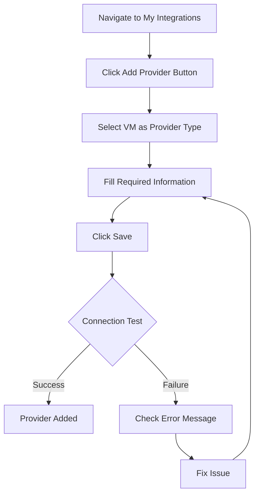
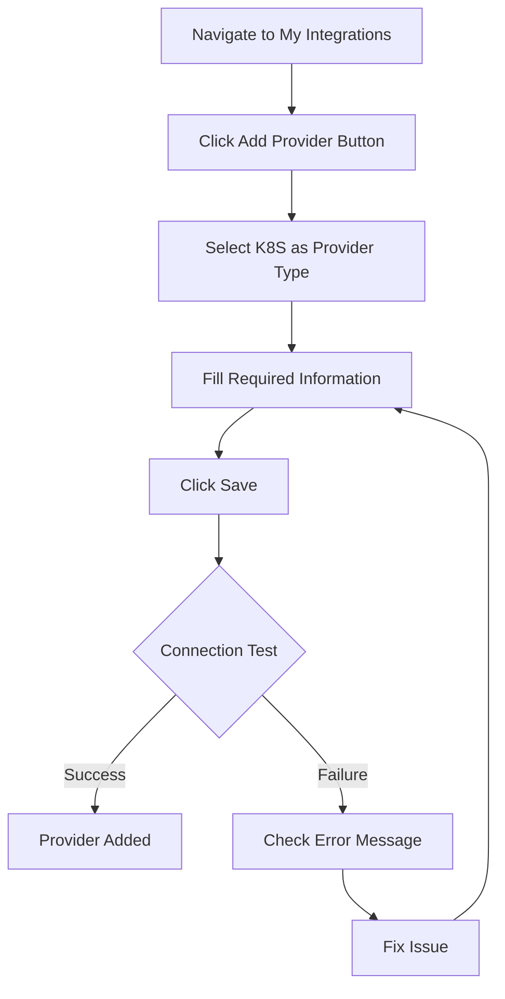

import Tabs from '@theme/Tabs';
import TabItem from '@theme/TabItem';

# Adding Providers

<div className="provider-header">
  <div className="provider-content">
    <h2 className="provider-subtitle">Connect Your Infrastructure</h2>
    <p>Providers are the foundation of OpsiMate. They represent the infrastructure where your services are running and enable monitoring, management, and automation.</p>
  </div>
</div>

## Understanding Providers

<div className="provider-types-grid">
  <div className="provider-type-card vm">
    <h3><i className="fas fa-server"></i> Virtual Machine (VM)</h3>
    <p>A standalone server or virtual machine running services that need to be monitored</p>
    <ul>
      <li>Physical servers</li>
      <li>Cloud VMs (AWS EC2, Azure VM, GCP)</li>
      <li>On-premise virtual machines</li>
    </ul>
  </div>
  <div className="provider-type-card k8s">
    <h3><i className="fas fa-cubes"></i> Kubernetes Cluster (K8S)</h3>
    <p>A Kubernetes cluster with multiple nodes and services organized in pods</p>
    <ul>
      <li>Self-managed Kubernetes</li>
      <li>Managed K8S (EKS, AKS, GKE)</li>
      <li>Minikube for development</li>
    </ul>
  </div>
</div>

:::info Connection Method
All providers connect to OpsiMate via **SSH**, allowing secure communication and service discovery without requiring agent installation.
:::

## Adding a Provider

<div className="provider-selection-tip">
  <div className="tip-icon">💡</div>
  <div className="tip-content">
    <strong>Not sure which provider type to choose?</strong> Use VM for individual servers and K8S for Kubernetes clusters. See <a href="/providers/provider-types">Provider Types</a> for detailed information.
  </div>
</div>

<Tabs>
  <TabItem value="vm" label="Virtual Machine" default>

### Prerequisites for VM Provider

<div className="prerequisites-box">
  <ul>
    <li><strong>SSH Access</strong>: Ability to connect to the VM via SSH</li>
    <li><strong>Private Key</strong>: A valid SSH private key for authentication</li>
    <li><strong>IP Address</strong>: The VM's IP address or hostname</li>
    <li><strong>Username</strong>: Account with sufficient permissions (sudo recommended)</li>
  </ul>
</div>

### Adding a VM Provider



1. Navigate to the **My Integrations** page from the sidebar
2. Click the **Add Provider** button
3. Select **VM** as the provider type
4. Fill in the required information:

<div className="form-fields">

| Field | Description | Example |
|-------|-------------|--------|
| **Name** | Descriptive name for your VM | `Production Server` |
| **Provider IP** | IP address of your VM | `192.168.1.100` |
| **Username** | SSH username | `ubuntu` |
| **Private Key Filename** | Path to SSH private key | `~/.ssh/id_rsa` |
| **SSH Port** | SSH port (usually 22) | `22` |
| **Provider Type** | Provider type | `VM` |

</div>

<!-- Image placeholder: Adding a VM provider -->

5. Click **Save** to add your VM provider
6. OpsiMate will test the connection and confirm if it's successful

:::tip SSH Key Permissions
Make sure your private key file has the correct permissions (usually `600`). You can set this with:
```bash
chmod 600 ~/.ssh/your_private_key
```
:::

  </TabItem>
  <TabItem value="k8s" label="Kubernetes Cluster">

### Prerequisites for K8S Provider

<div className="prerequisites-box">
  <ul>
    <li><strong>SSH Access</strong>: Ability to connect to at least one Kubernetes node</li>
    <li><strong>Private Key</strong>: A valid SSH private key for authentication</li>
    <li><strong>IP Address</strong>: The K8S node's IP address or hostname</li>
    <li><strong>Username</strong>: Account with sufficient permissions</li>
    <li><strong>kubectl</strong>: Properly configured on the node</li>
  </ul>
</div>

### Adding a Kubernetes Provider



1. Navigate to the **My Integrations** page from the sidebar
2. Click the **Add Provider** button
3. Select **K8S** as the provider type
4. Fill in the required information:

<div className="form-fields">

| Field | Description | Example |
|-------|-------------|--------|
| **Name** | Descriptive name for your cluster | `Production Cluster` |
| **Provider IP** | IP address of your K8S node | `192.168.1.200` |
| **Username** | SSH username | `k8s-admin` |
| **Private Key Filename** | Path to SSH private key | `~/.ssh/k8s_rsa` |
| **SSH Port** | SSH port (usually 22) | `22` |
| **Provider Type** | Provider type | `K8S` |

</div>

<!-- Image placeholder: Adding a Kubernetes provider -->

5. Click **Save** to add your Kubernetes provider
6. OpsiMate will test the connection and confirm if it's successful

:::info Kubernetes Configuration
OpsiMate uses the default kubectl configuration on the node. Make sure kubectl is properly set up and has access to your cluster.
```bash
# Verify kubectl works on the node
ssh user@node "kubectl get nodes"
```
:::

  </TabItem>
</Tabs>

## Managing Providers

<div className="management-grid">
  <div className="management-card edit">
    <h3><i className="fas fa-edit"></i> Editing a Provider</h3>
    <ol>
      <li>Go to the <strong>My Integrations</strong> page</li>
      <li>Find the provider you want to edit</li>
      <li>Click the <strong>Edit</strong> button (pencil icon)</li>
      <li>Update the provider information as needed</li>
      <li>Click <strong>Save</strong> to apply your changes</li>
    </ol>
  </div>
  <div className="management-card delete">
    <h3><i className="fas fa-trash"></i> Removing a Provider</h3>
    <ol>
      <li>Go to the <strong>My Integrations</strong> page</li>
      <li>Find the provider you want to remove</li>
      <li>Click the <strong>Delete</strong> button (trash icon)</li>
      <li>Confirm the deletion when prompted</li>
    </ol>
    <div className="warning-box">
      <strong>Warning:</strong> Removing a provider will also remove all associated services and monitoring configurations.
    </div>
  </div>
</div>

## Troubleshooting Connection Issues

<Tabs>
  <TabItem value="common" label="Common Issues" default>

<div className="troubleshooting-container">
  <div className="issue-card">
    <h3>Connection Timeout</h3>
    <p><strong>Symptoms:</strong> Connection attempts time out with no response</p>
    <p><strong>Possible Causes:</strong></p>
    <ul>
      <li>Incorrect IP address</li>
      <li>Firewall blocking SSH port</li>
      <li>Provider is offline</li>
    </ul>
    <p><strong>Solutions:</strong></p>
    <ol>
      <li>Verify the IP address is correct</li>
      <li>Check if SSH port (usually 22) is open</li>
      <li>Try to ping the provider to check connectivity</li>
    </ol>
  </div>

  <div className="issue-card">
    <h3>Authentication Failure</h3>
    <p><strong>Symptoms:</strong> "Permission denied" or "Authentication failed" errors</p>
    <p><strong>Possible Causes:</strong></p>
    <ul>
      <li>Incorrect username</li>
      <li>Invalid or wrong private key</li>
      <li>Incorrect key permissions</li>
    </ul>
    <p><strong>Solutions:</strong></p>
    <ol>
      <li>Verify the username is correct</li>
      <li>Check that the private key path is correct</li>
      <li>Set proper permissions on the key file: <code>chmod 600 ~/.ssh/your_key</code></li>
    </ol>
  </div>
</div>

  </TabItem>
  <TabItem value="vm" label="VM-Specific Issues">

<div className="troubleshooting-container">
  <div className="issue-card">
    <h3>Service Discovery Fails</h3>
    <p><strong>Symptoms:</strong> Provider connects but no services are discovered</p>
    <p><strong>Possible Causes:</strong></p>
    <ul>
      <li>Insufficient permissions for the SSH user</li>
      <li>Services not running as systemd services</li>
      <li>Custom service configuration not recognized</li>
    </ul>
    <p><strong>Solutions:</strong></p>
    <ol>
      <li>Ensure the SSH user has sudo privileges</li>
      <li>Check if services are running with <code>systemctl list-units --type=service</code></li>
      <li>Manually verify service status on the VM</li>
    </ol>
  </div>
</div>

  </TabItem>
  <TabItem value="k8s" label="K8S-Specific Issues">

<div className="troubleshooting-container">
  <div className="issue-card">
    <h3>Kubectl Access Issues</h3>
    <p><strong>Symptoms:</strong> "kubectl command not found" or permission errors</p>
    <p><strong>Possible Causes:</strong></p>
    <ul>
      <li>kubectl not installed or not in PATH</li>
      <li>User doesn't have proper RBAC permissions</li>
      <li>Kubeconfig not properly set up</li>
    </ul>
    <p><strong>Solutions:</strong></p>
    <ol>
      <li>Verify kubectl is installed: <code>which kubectl</code></li>
      <li>Check RBAC permissions: <code>kubectl auth can-i list pods</code></li>
      <li>Ensure KUBECONFIG is properly set in the environment</li>
    </ol>
  </div>
</div>

  </TabItem>
</Tabs>

<details>
<summary className="manual-check-summary">Manual Connection Verification</summary>

<div className="code-block-container">

```bash
# Test SSH connection to VM or K8S node
ssh -i /path/to/private_key username@provider_ip

# For VM providers, check running services
ssh -i /path/to/private_key username@provider_ip "sudo systemctl list-units --type=service"

# For K8S providers, check cluster access
ssh -i /path/to/private_key username@provider_ip "kubectl get nodes"
```

</div>
</details>

## Next Steps

<div className="next-steps-container">
  <div className="next-step-card">
    <div className="step-number">1</div>
    <h3>Discover Services</h3>
    <p>After adding your providers, discover services running on them to start monitoring.</p>
    <a href="/getting-started/discovering-services" className="next-link">Discover Services Guide →</a>
  </div>
  
  <div className="next-step-card">
    <div className="step-number">2</div>
    <h3>Set Up Integrations</h3>
    <p>Connect monitoring tools like Grafana, Prometheus, or Kibana to enhance visibility.</p>
    <a href="/integrations/overview" className="next-link">Integrations Overview →</a>
  </div>
  
  <div className="next-step-card">
    <div className="step-number">3</div>
    <h3>Configure Alerts</h3>
    <p>Set up alerting to be notified when issues occur with your services.</p>
    <a href="/monitoring/setting-up-alerts" className="next-link">Alert Configuration →</a>
  </div>
</div>
4. **Verify Username**: Confirm the username has sufficient permissions on the provider
5. **Check SSH Port**: Verify the SSH port is correct and open

## Next Steps

After adding your providers, you can:

1. [[Discover services](/docs/](/getting-started/discovering-services) running on your providers
2. [[Set up monitoring](/docs/](/monitoring/setting-up-alerts) for your services
3. [[Configure integrations](/docs/](/integrations/overview) with third-party tools
