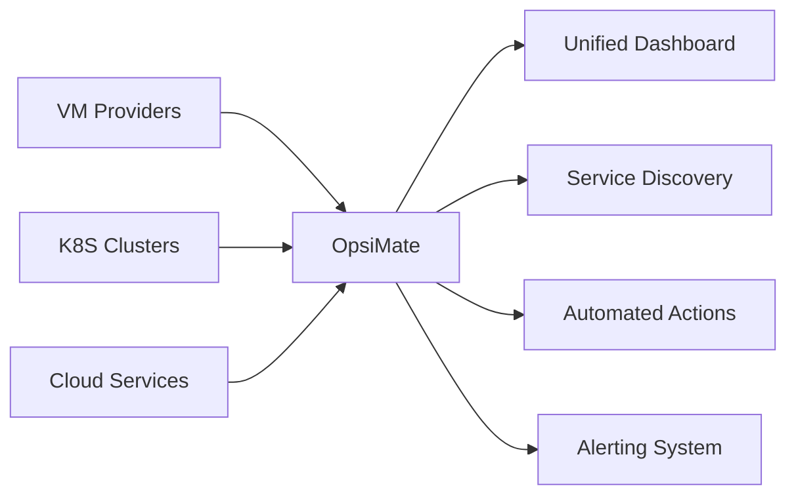

# OpsiMate Documentation

<div className="hero-banner">
  <div className="hero-content">
    <h1 className="hero-title">Unified Service Monitoring & Management Platform</h1>
    <p className="hero-subtitle">Monitor, manage, and optimize your entire infrastructure from a single dashboard</p>
  </div>
</div>

<!-- Image placeholder: OpsiMate dashboard preview -->

:::tip 🎉 What's New in v2.5
🏷️ **Enhanced Multi-Tag Alerts** - Services now show alerts for all their tags with proper deduplication

📊 **Kibana Integration** - Connect to Kibana for powerful log visualization and search

🔗 **Improved External Links Dropdown** - Fixed auto-closing issues with controlled state management

⚡ **Performance Improvements** - Faster dashboard loading and better resource management
:::

## Platform Overview

OpsiMate is a unified service monitoring and management platform that brings together monitoring, management, and automation in one powerful solution. Whether you're running services on VMs, Kubernetes clusters, or a hybrid environment, OpsiMate gives you complete visibility and control over your infrastructure.

<div className="feature-grid">
  <div className="feature-card">
    <h3>🔍 Complete Visibility</h3>
    <p>Real-time monitoring of all your services across different providers in one unified view</p>
  </div>
  <div className="feature-card">
    <h3>⚡ Rapid Response</h3>
    <p>Automated actions and incident management tools to minimize downtime</p>
  </div>
  <div className="feature-card">
    <h3>🔄 Seamless Integration</h3>
    <p>Connect with Grafana, Prometheus, Coralogix, and Kibana for comprehensive insights</p>
  </div>
  <div className="feature-card">
    <h3>🛠️ Powerful Automation</h3>
    <p>Create, schedule, and trigger actions to streamline operations</p>
  </div>
</div>

## Key Capabilities

### Infrastructure Management



- **Multi-Provider Support**: Connect to VMs and Kubernetes clusters
- **Automated Service Discovery**: Detect SYSTEMD services, Docker containers, and K8S deployments
- **Type-Safe Provider Model**: Strict type safety with Zod schema validation
- **Secure Connections**: SSH-based secure communication

#### Provider Configuration

OpsiMate supports multiple provider types with type-safe configuration:

```typescript
// Provider configuration example
const provider = {
  name: "production-server",
  providerIp: "192.168.1.100",
  username: "admin",
  privateKeyFilename: "id_rsa",
  SSHPort: 22,
  providerType: "VM" // VM or K8S
};
```

> **Note**: The provider configuration uses camelCase format for all fields. The server validation schema enforces proper typing for all fields.

### Comprehensive Monitoring

<div className="monitoring-features">
  <div className="monitoring-feature">
    <h4>Service Status</h4>
    <div className="status-indicators">
      <span className="status running">Running</span>
      <span className="status warning">Warning</span>
      <span className="status error">Error</span>
    </div>
  </div>
  <div className="monitoring-feature">
    <h4>Performance Metrics</h4>
    <ul>
      <li>CPU & Memory Usage</li>
      <li>Disk Space</li>
      <li>Network Traffic</li>
      <li>Custom Metrics</li>
    </ul>
  </div>
  <div className="monitoring-feature">
    <h4>Advanced Alerting</h4>
    <ul>
      <li>Multi-Tag Support</li>
      <li>Alert Deduplication</li>
      <li>Notification Channels</li>
      <li>Custom Thresholds</li>
    </ul>
  </div>
</div>

#### Enhanced Multi-Tag Alert System

The OpsiMate alert system has been enhanced with advanced tag-based functionality:

- **Multi-Tag Support**: Services now receive alerts for all their associated tags
- **Alert Deduplication**: Alerts are properly deduplicated if they match multiple tags of the same service
- **Cross-Service Visibility**: Alerts appear under all relevant services that share matching tags
- **Service-Specific Alert Storage**: Each service maintains its own alert list based on its specific tags

```typescript
// Service with multiple tags and service-specific alerts
interface Service {
  id: string;
  name: string;
  serviceIp: string;
  serviceStatus: string;
  tags: string[];
  serviceAlerts?: Alert[];
  // Other service properties
}
```

### Powerful Integrations

<div className="integration-grid">
  <div className="integration-card grafana">
    <h4>Grafana</h4>
    <p>Access dashboards directly from OpsiMate and import alerts</p>
  </div>
  <div className="integration-card prometheus">
    <h4>Prometheus</h4>
    <p>Collect and visualize metrics from your infrastructure</p>
  </div>
  <div className="integration-card coralogix">
    <h4>Coralogix</h4>
    <p>Advanced log analysis and monitoring</p>
  </div>
  <div className="integration-card kibana">
    <h4>Kibana</h4>
    <p>Powerful log visualization and search capabilities</p>
  </div>
</div>

#### External Links Dropdown

The External Links dropdown provides access to integration dashboards with improved user experience:

- **Controlled Dropdown State**: Dropdown stays open during background data updates
- **Lazy Data Loading**: Dashboard data is only fetched when the dropdown is opened
- **Manual Refresh Control**: Users can manually refresh dashboard data when needed
- **Preserved User Intent**: Dropdown only closes when the user explicitly closes it

### Automated Actions

OpsiMate provides a powerful action system for automating routine tasks and responding to incidents:

```typescript
// Example action template
const restartServiceAction = {
  name: "Restart Failed Service",
  description: "Automatically restart a service when it enters failed state",
  category: "Maintenance",
  estimatedDuration: 60, // seconds
  steps: [
    {
      provider: "vm-provider-1",
      command: "systemctl restart ${service.name}",
      condition: "${service.status === 'failed'}",
      timeout: 30,
      retries: 2
    },
    {
      provider: "notification-provider",
      command: "sendNotification('Service ${service.name} restarted')",
      runAfter: "success"
    }
  ]
};
```

#### Action Features

- **Action Templates**: Pre-built templates for quick action creation
- **Statistics Dashboard**: View total actions, success rate, running actions, and scheduled actions
- **Advanced Action Creation**: Configure name, description, category, estimated duration, and steps
- **Step Management**: Set provider, timeout, retries, and conditions for each step
- **Execution History**: Track all action executions with detailed logs
- **Favorites**: Mark frequently used actions as favorites for quick access

### Incident Response

<div className="incident-workflow">
  <div className="incident-step">
    <div className="step-number">1</div>
    <div className="step-content">
      <h4>Alert Detection</h4>
      <p>Automatic detection of service issues</p>
    </div>
  </div>
  <div className="incident-step">
    <div className="step-number">2</div>
    <div className="step-content">
      <h4>Automated Response</h4>
      <p>Trigger predefined actions to address the issue</p>
    </div>
  </div>
  <div className="incident-step">
    <div className="step-number">3</div>
    <div className="step-content">
      <h4>Resolution Tracking</h4>
      <p>Document resolution steps and outcomes</p>
    </div>
  </div>
  <div className="incident-step">
    <div className="step-number">4</div>
    <div className="step-content">
      <h4>Post-Incident Analysis</h4>
      <p>Review and improve response procedures</p>
    </div>
  </div>
</div>

## Getting Started

### System Requirements

- **Server**: Node.js v16+ and npm v7+
- **Database**: SQLite (included) or PostgreSQL
- **Supported Browsers**: Chrome, Firefox, Safari, Edge (latest versions)

### Quick Installation

```bash
# Clone the repository
git clone https://github.com/opsimate/opsimate.git

# Install dependencies
cd opsimate
npm install

# Start the development server
npm run dev
```

### Adding Your First Provider

1. Navigate to the **My Integrations** page
2. Click **Add Provider**
3. Enter the provider details:
   - Name
   - Provider IP
   - Username
   - SSH Private Key filename
   - SSH Port (default: 22)
   - Provider Type (VM or K8S)
4. Click **Save** to add the provider

### Discovering Services

Once you've added a provider, OpsiMate will automatically discover services running on it:

1. For VM providers: SYSTEMD services
2. For Kubernetes providers: Deployments, StatefulSets, and DaemonSets

## Technical Specifications

### Architecture

OpsiMate follows a modern architecture pattern:

- **Frontend**: React with TypeScript
- **Backend**: Node.js with Express
- **Database**: SQLite (default) with option for PostgreSQL
- **Communication**: REST API with WebSocket for real-time updates

### Type Safety

OpsiMate is built with strict type safety in mind:

- No use of `any` types in the codebase
- Zod schema inference for all types
- Discriminated unions for provider types
- Proper error handling with type guards

### Security

- SSH-based secure communication with providers
- Private key authentication
- No storage of sensitive credentials
- Role-based access control

## Support and Resources

- **GitHub Repository**: [github.com/opsimate/opsimate](https://github.com/opsimate/opsimate)
- **Documentation**: [docs.opsimate.com](https://docs.opsimate.com)
- **Issue Tracker**: [github.com/opsimate/opsimate/issues](https://github.com/opsimate/opsimate/issues)

## What's New in OpsiMate v2.5

### Enhanced Multi-Tag Alerts

Alerts are now properly associated with all relevant services based on their tags:
- Each service shows alerts for all its tags, not just one
- Alerts are deduplicated if they match multiple tags of the same service
- Services with multiple tags show all relevant alerts

### Kibana Integration

We've added full support for Kibana:
- Connect to your Kibana instances
- View logs directly within OpsiMate
- Create log-based alerts
- Access Kibana dashboards from the External Links dropdown

### Improved External Links Dropdown

The External Links dropdown now behaves professionally:
- Stays open during background data updates
- No automatic closing when selecting items
- Manual refresh control for dashboard data
- Smooth background updates without affecting open dropdowns

## Getting Started

<div className="getting-started-grid">
  <div className="getting-started-card">
    <div className="card-number">1</div>
    <h3>Add Providers</h3>
    <p>Connect your infrastructure providers to OpsiMate</p>
    <a href="/getting-started/adding-providers" className="card-link">Learn how →</a>
  </div>
  <div className="getting-started-card">
    <div className="card-number">2</div>
    <h3>Discover Services</h3>
    <p>Automatically find and monitor your running services</p>
    <a href="/getting-started/discovering-services" className="card-link">Learn how →</a>
  </div>
  <div className="getting-started-card">
    <div className="card-number">3</div>
    <h3>Set Up Integrations</h3>
    <p>Connect your monitoring tools for enhanced visibility</p>
    <a href="/integrations/overview" className="card-link">Learn how →</a>
  </div>
  <div className="getting-started-card">
    <div className="card-number">4</div>
    <h3>Create Dashboards</h3>
    <p>Build custom views to monitor what matters most</p>
    <a href="/dashboards/creating-dashboards" className="card-link">Learn how →</a>
  </div>
</div>

<div className="cta-container">
  <a href="/getting-started/quick-start" className="primary-button">
    Quick Start Guide
  </a>
  <a href="https://github.com/opsimate/opsimate" className="secondary-button">
    GitHub Repository
  </a>
</div>

## Community & Support

<div className="community-section">
  <div className="community-card">
    <h3>Documentation</h3>
    <p>Comprehensive guides and API references</p>
    <a href="/category/getting-started">Browse Docs →</a>
  </div>
  <div className="community-card">
    <h3>GitHub</h3>
    <p>Source code, issues, and contributions</p>
    <a href="https://github.com/opsimate/opsimate">Visit Repository →</a>
  </div>
  <div className="community-card">
    <h3>Community Forum</h3>
    <p>Ask questions and share knowledge</p>
    <a href="https://community.opsimate.io">Join Discussion →</a>
  </div>
</div>
