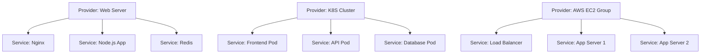

# 🎯 Providers & Services Overview

Understanding the relationship between providers and services is key to effectively using Service Peek for infrastructure monitoring.

## 🏗️ What are Providers?

**Providers** are the infrastructure platforms where your applications run. Think of them as the "containers" that host your services:

  

    <h3 style={{color: 'white', margin: '0 0 10px 0'}}>🖥️ Server Provider</h3>
    
A single server or VM that hosts multiple services

    <ul style={{margin: 0, paddingLeft: '20px', fontSize: '14px'}}>
      <li>Systemd services</li>
      <li>Docker containers</li>
      <li>Background processes</li>
    </ul>
  

  
  

    <h3 style={{color: 'white', margin: '0 0 10px 0'}}>☸️ K8S Cluster</h3>
    
Kubernetes cluster with multiple nodes

    <ul style={{margin: 0, paddingLeft: '20px', fontSize: '14px'}}>
      <li>Pods across nodes</li>
      <li>Deployments</li>
      <li>Services & ingress</li>
    </ul>
  

  
  

    <h3 style={{color: 'white', margin: '0 0 10px 0'}}>☁️ AWS EC2 (Dynamic)</h3>
    
Auto-scaling group of multiple servers

    <ul style={{margin: 0, paddingLeft: '20px', fontSize: '14px'}}>
      <li>Multiple EC2 instances</li>
      <li>Auto-discovered services</li>
      <li>Dynamic scaling</li>
    </ul>
  

## 🚀 What are Services?

**Services** are the actual applications and processes that deliver value to your users. These are what you really care about monitoring:

### Service Types

  

    <strong>🐳 Containers</strong> 
    <small>Docker containers running your applications</small>
  

  

    <strong>⚙️ Systemd Services</strong> 
    <small>Linux system services managed by systemd</small>
  

  

    <strong>🎯 Kubernetes Pods</strong> 
    <small>Containerized apps in Kubernetes clusters</small>
  

## 🔄 The Provider-Service Relationship

## 🎯 Why This Matters

Understanding this relationship helps you:

- **🔍 Organize Monitoring**: Group related services under their infrastructure
- **🚨 Set Smart Alerts**: Alert on provider issues vs individual service issues  
- **📊 View Dependencies**: See how services relate across your infrastructure
- **⚡ Quick Actions**: Restart services or entire providers as needed

## 🔄 Automatic Service Discovery

When you add a provider, Service Peek automatically discovers services:

:::info Auto-Discovery Process
1. **Connect** to your provider via SSH
2. **Scan** for running services (systemd, Docker, K8s)
3. **Import** discovered services into your dashboard
4. **Monitor** service health and status continuously
:::

## 🚀 Getting Started

Ready to set up your infrastructure monitoring?

1. **[Add Providers](providers/add-provider)** - Connect your infrastructure
2. **[Discover Services](services/add-services)** - Find and import your applications  
3. **[Monitor Everything](../services/managing-services)** - Keep your services healthy

:::tip Pro Tip
Start with one provider and let Service Peek discover its services automatically. You can always add more providers and manually add specific services later!
:::
