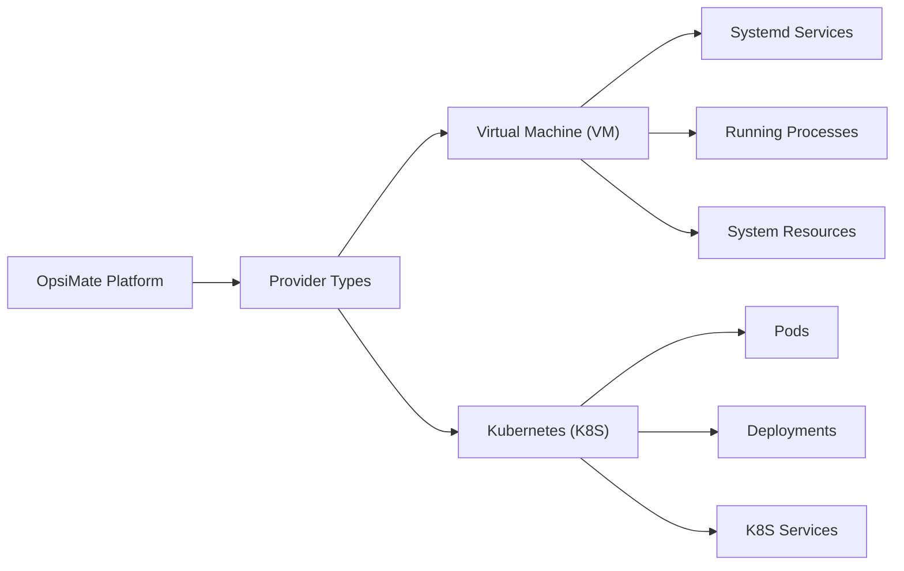
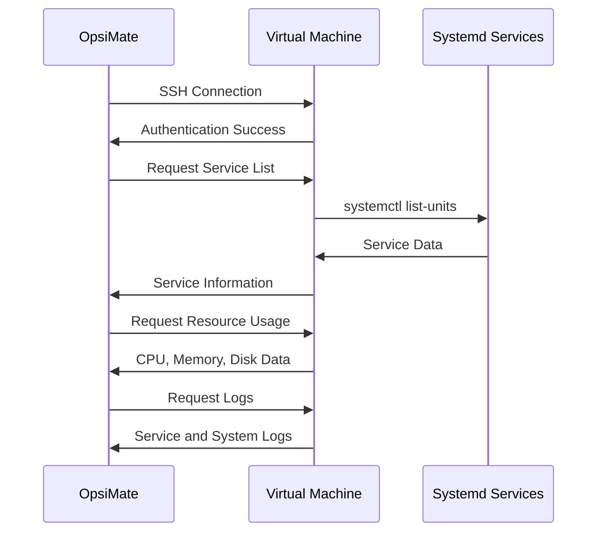
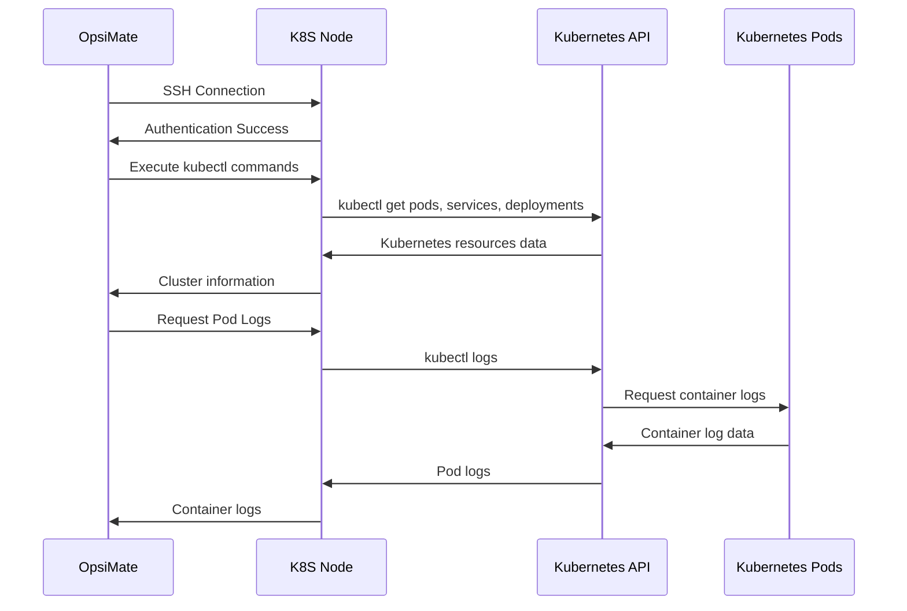

import Tabs from '@theme/Tabs';
import TabItem from '@theme/TabItem';

# Provider Types

<div className="provider-types-header">
  <div className="provider-types-content">
    <h2 className="provider-types-subtitle">Infrastructure Management Options</h2>
    <p>OpsiMate supports different types of infrastructure providers to accommodate various deployment environments. This guide explains the different provider types, their capabilities, and how to work with them effectively.</p>
  </div>
</div>

## Understanding Provider Types

<div className="provider-comparison">
  <div className="comparison-intro">
    <p>In OpsiMate, a provider represents the infrastructure where your services are running. The platform currently supports two main provider types with different capabilities and use cases.</p>
  </div>

  <div className="comparison-table-container">

  | Feature | Virtual Machine (VM) | Kubernetes (K8S) |
  |---------|---------------------|-------------------|
  | **Architecture** | Traditional servers or VMs | Container orchestration platform |
  | **Service Types** | Systemd services, processes | Pods, deployments, services |
  | **Scaling** | Manual scaling | Automatic scaling capabilities |
  | **Deployment** | Traditional deployment | Container-based deployment |
  | **Monitoring Focus** | Host-level metrics, service status | Pod health, container metrics |
  | **Best For** | Traditional applications, monoliths | Microservices, containerized apps |

  </div>
</div>



:::info Provider Selection
Choose the provider type that best matches your infrastructure. You can add multiple providers of different types to monitor hybrid environments.
:::

## Provider Details

<Tabs>
  <TabItem value="vm" label="Virtual Machine Providers" default>

<div className="provider-detail-header vm">
  <h3><i className="fas fa-server"></i> Virtual Machine Providers</h3>
  <p>VM providers are traditional servers or virtual machines that host services directly on the operating system.</p>
</div>

### VM Provider Capabilities

<div className="capabilities-grid">
  <div className="capability-card">
    <div className="capability-icon">🔍</div>
    <h4>SYSTEMD Service Discovery</h4>
    <p>Automatically detect and monitor systemd services running on the VM</p>
  </div>
  <div className="capability-card">
    <div className="capability-icon">📊</div>
    <h4>Process Monitoring</h4>
    <p>Track running processes on the VM with detailed status information</p>
  </div>
  <div className="capability-card">
    <div className="capability-icon">📈</div>
    <h4>Resource Utilization</h4>
    <p>Monitor CPU, memory, and disk usage with historical data</p>
  </div>
  <div className="capability-card">
    <div className="capability-icon">📝</div>
    <h4>Log Collection</h4>
    <p>Gather and analyze logs from the system and services</p>
  </div>
</div>

### How VM Providers Work



### VM Provider Configuration

<div className="config-form">

| Field | Description | Required | Default |
|-------|-------------|:--------:|:-------:|
| **Name** | Descriptive name for your VM | ✅ | - |
| **Provider IP** | IP address of your VM | ✅ | - |
| **Username** | SSH username for authentication | ✅ | - |
| **Private Key Filename** | Path to your SSH private key | ✅ | - |
| **SSH Port** | SSH port | ❌ | 22 |
| **Provider Type** | Provider type | ✅ | VM |

</div>

<!-- Image placeholder: VM Provider Configuration form -->

:::tip Best Practices
For VM providers, we recommend:
- Using a dedicated user with sudo privileges for OpsiMate
- Setting up key-based authentication instead of passwords
- Ensuring all critical services are running as systemd services for better monitoring
:::

  </TabItem>
  <TabItem value="k8s" label="Kubernetes Providers">

<div className="provider-detail-header k8s">
  <h3><i className="fas fa-cubes"></i> Kubernetes Providers</h3>
  <p>Kubernetes providers are clusters that manage containerized applications using Kubernetes orchestration.</p>
</div>

### K8S Provider Capabilities

<div className="capabilities-grid">
  <div className="capability-card">
    <div className="capability-icon">🔄</div>
    <h4>Pod Discovery</h4>
    <p>Automatically detect and monitor Kubernetes pods across namespaces</p>
  </div>
  <div className="capability-card">
    <div className="capability-icon">🚀</div>
    <h4>Deployment Monitoring</h4>
    <p>Track the status of deployments with rollout history</p>
  </div>
  <div className="capability-card">
    <div className="capability-icon">🌐</div>
    <h4>Service Discovery</h4>
    <p>Identify Kubernetes services and their endpoints</p>
  </div>
  <div className="capability-card">
    <div className="capability-icon">📋</div>
    <h4>Container Logs</h4>
    <p>Access logs from containers running in the cluster</p>
  </div>
  <div className="capability-card">
    <div className="capability-icon">⚖️</div>
    <h4>Resource Utilization</h4>
    <p>Monitor resource usage across the cluster with node-level metrics</p>
  </div>
</div>

### How K8S Providers Work



### K8S Provider Configuration

<div className="config-form">

| Field | Description | Required | Default |
|-------|-------------|:--------:|:-------:|
| **Name** | Descriptive name for your K8S cluster | ✅ | - |
| **Provider IP** | IP address of a node in your cluster | ✅ | - |
| **Username** | SSH username for authentication | ✅ | - |
| **Private Key Filename** | Path to your SSH private key | ✅ | - |
| **SSH Port** | SSH port | ❌ | 22 |
| **Provider Type** | Provider type | ✅ | K8S |

</div>

<!-- Image placeholder: Kubernetes Provider Configuration form -->

:::tip Best Practices
For K8S providers, we recommend:
- Using a node with kubectl access to the entire cluster
- Setting up proper RBAC permissions for the kubectl user
- Using labels on your pods for better organization in OpsiMate
:::

  </TabItem>
</Tabs>

## Provider Data Model

OpsiMate uses a type-safe provider data model to ensure consistency and reliability:

### Provider Interface

The core provider interface includes:

```typescript
interface Provider {
  id: string;
  name: string;
  providerIp: string;
  username: string;
  privateKeyFilename: string;
  SSHPort: number;
  createdAt: string;
  providerType: 'VM' | 'K8S';
}
```

### Type-Safe Provider Handling

OpsiMate implements strict type safety for provider data:

1. **Discriminated Union Types**: Provider types use discriminated unions to ensure type safety
2. **Zod Schema Validation**: All provider data is validated using Zod schemas
3. **No Type Casting**: TypeScript infers types automatically without manual casting
4. **Strict Error Handling**: Proper error typing with unknown types and type guards

This ensures that:
- Provider data is always consistent
- Type errors are caught at compile time
- Runtime errors are properly handled and typed
- The application maintains data integrity

## Provider Connection

OpsiMate connects to providers using SSH:

1. **Authentication**: Uses SSH keys for secure authentication
2. **Command Execution**: Runs commands on the provider to discover and monitor services
3. **Data Collection**: Gathers metrics and logs from the provider
4. **Status Monitoring**: Regularly checks the status of services on the provider

### Connection Troubleshooting

If you encounter connection issues:

1. **Check SSH Access**: Ensure you can SSH into the provider manually
2. **Verify Private Key**: Make sure the private key path is correct and the key has proper permissions
3. **Check Network Connectivity**: Ensure there are no firewall rules blocking SSH access
4. **Verify Username**: Confirm the username has sufficient permissions on the provider
5. **Check SSH Port**: Verify the SSH port is correct and open

## Provider Management

### Editing Providers

To edit a provider:

1. Navigate to the **My Integrations** page
2. Find the provider you want to edit
3. Click the **Edit** button (pencil icon)
4. Update the provider information
5. Click **Save** to apply your changes

Note: When editing providers, all fields are sent in camelCase format to the server as required by the validation schema.

### Removing Providers

To remove a provider:

1. Navigate to the **My Integrations** page
2. Find the provider you want to remove
3. Click the **Delete** button (trash icon)
4. Confirm the deletion when prompted

:::caution
Removing a provider will also remove all associated services and monitoring configurations.
:::

## Provider Discovery

After adding a provider, OpsiMate can discover services running on it:

1. Navigate to the **My Integrations** page
2. Find your provider in the list
3. Click the **Discover Services** button
4. OpsiMate will connect to your provider and automatically detect running services

For VM providers, this will discover SYSTEMD services.
For K8S providers, this will discover pods, deployments, and services.

## Best Practices for Providers

- **Use Descriptive Names**: Give providers clear, identifiable names
- **Secure SSH Keys**: Store SSH private keys securely
- **Regular Updates**: Keep provider information up to date
- **Monitor Connection Status**: Regularly check that OpsiMate can connect to your providers
- **Limit Permissions**: Use accounts with only the necessary permissions
- **Document Provider Details**: Keep records of provider configurations

## Next Steps

After setting up your providers:

1. [[Discover services](/docs/](/getting-started/discovering-services) running on your providers
2. [[Set up monitoring](/docs/](/monitoring/setting-up-alerts) for your services
3. [[Create custom dashboards](/docs/](/dashboards/creating-dashboards) to visualize your infrastructure
